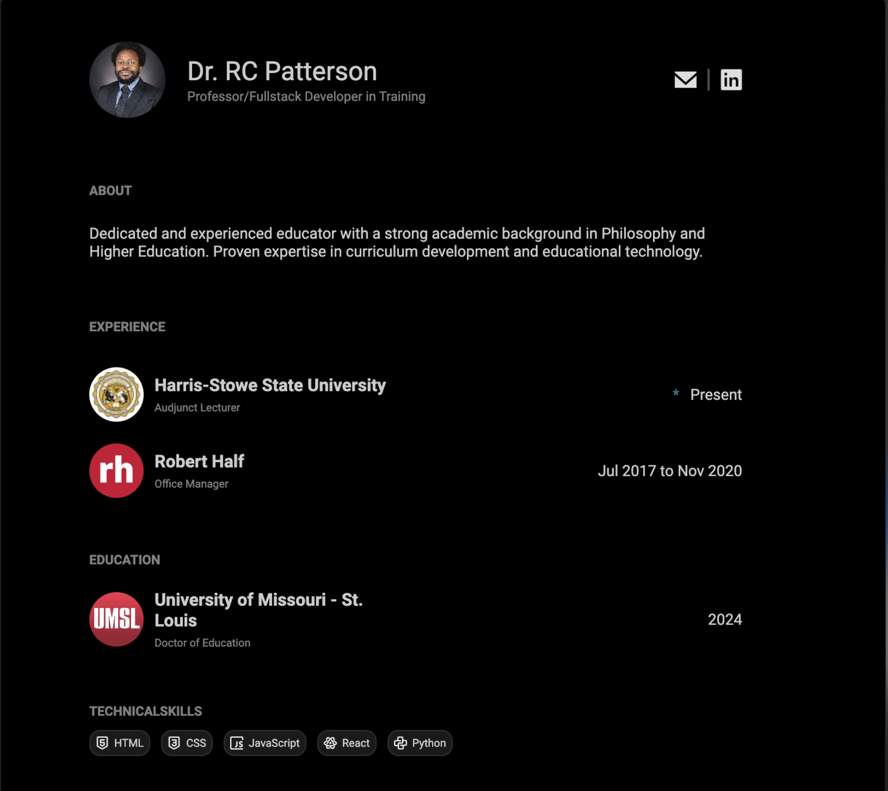

# Alternative CV Implementation

This is an alternative implementation of the CV/resume project, showcasing a different approach to building a professional portfolio website.



## Project Structure

```
another-approach/
├── src/
│   ├── assets/     # Images and other media files
│   ├── css/        # Stylesheets
│   ├── fonts/      # Custom fonts
│   └── js/         # JavaScript files
├── index.html      # Main HTML file
└── preview.png     # Final result preview
```

## Implementation Approach

This version takes a more traditional web development approach using vanilla HTML, CSS, and JavaScript. Key features include:

- **Modular CSS**: Separated into base, layout, and font stylesheets for better organization
- **Responsive Design**: Built with a mobile-first approach
- **Component-Based Structure**: Each section (header, experience, education, etc.) is modular and reusable
- **Custom Icons**: Using custom icon implementations for skills and social links
- **Clean Typography**: Custom font implementation for professional appearance

## Technical Choices

- **Vanilla Stack**: Using pure HTML, CSS, and JavaScript for simplicity and performance
- **CSS Grid & Flexbox**: Modern layout techniques for responsive design
- **Custom Components**: Building reusable components without framework dependencies
- **Optimized Assets**: Efficient handling of images and fonts

## Key Features

- Professional two-column layout
- Responsive design that works on all devices
- Interactive elements with hover effects
- Clean, modern typography
- Optimized performance with minimal dependencies

## Getting Started

1. Clone the repository
2. Open `index.html` in a web browser
3. No build process required - it's ready to use!

## Credits

Design inspired by the [Svelte 5 Portfolio Template](https://github.com/thomaslappenbusch/svelte-5-portfolio) by Josh Nussbaum.
